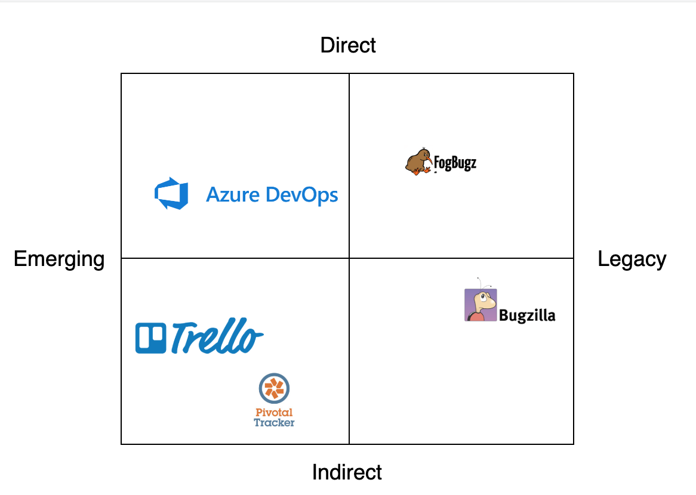
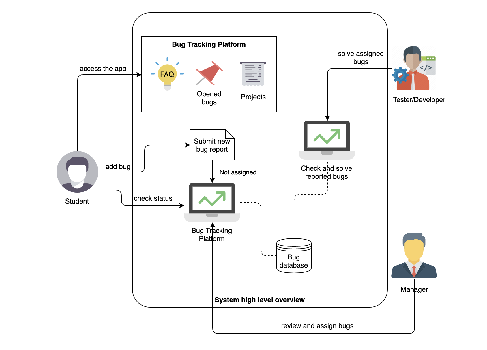

# Bugsbunny Project

The bunny that will organize your bugs!

## Introducere

Bugsbunny dorește a fi o aplicație web care să permită identificarea și rezolvarea bug-urilor dintr-o aplicație. Întrucât problemele și erorile software sunt partajate cu mai multe persoane, membrii într-o echipă de proiect, acestea vor fi soluționate mai rapid decât în cazul în care o singură persoană ar lucra la rezolvarea bug-ului. Astfel se reduce timpul în care o eroare este rezolvată și astfel procesul de dezvoltare al aplicației poate continua.

* Obiectiv

* Descriere aplicație

* Tipuri de utilizatori cărora li se adresează produsul nostru

* Analiza pieței și principalii concurenți

Aplicația dezvoltată oferă un set de caracteristici personalizabile care răspund nevoilor fiecărei echipe. Bug management-ul și flow-urile de rezolvare a erorilor sunt elemente esențiale în procesul de dezvoltare software existând multe produse ce fac deja acest lucru: Trello, Pivotal Tracker, Bugzilla, FogBugz sau Azure DevOps.

* Arhitectura high-level

## Interfețe aplicație

## API REST
